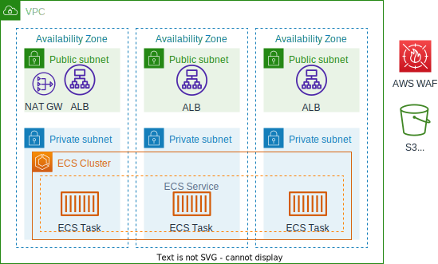

# Sample CDK of ECS Containers

## Prerequire

To deploy this IaC, you'll need the following:

- [AWS CLI](https://docs.aws.amazon.com/cli/latest/userguide/cli-chap-getting-started.html)
- [Configure AWS credential](https://docs.aws.amazon.com/cli/latest/userguide/cli-configure-files.html)
- [Node.js](https://nodejs.org/)
- [AWS CDK Toolkit](https://docs.aws.amazon.com/cdk/v2/guide/getting_started.html#getting_started_install) >=2.69.0

## How to deploy

1. The first time you deploy with AWS CDK into an environment (account/region), you need to run following.
```
cdk bootstrap
```
Then:
```
 ⏳  Bootstrapping environment aws://123456789012/us-east-1...
...
```

2. Run a following command and deploy your CDK app.
```
cdk deploy
```

Then:
```
dev-EcsNginxStack: deploying... [1/1]
[0%] start: Publishing bd2f6f8f5fcfefe90f3695c0c8f5457eb000c0b9de3fda21209051796b262cf8:current_account-ap-northeast-1
[100%] success: Published bd2f6f8f5fcfefe90f3695c0c8f5457eb000c0b9de3fda21209051796b262cf8:current_account-ap-northeast-1
dev-EcsNginxStack: creating CloudFormation changeset...

 ✅  dev-EcsNginxStack

✨  Deployment time: 100.65s

Outputs:
dev-EcsNginxStack.AlbDnsName = dev-E-Alb16-NGPFS53SP3PH-791827369.ap-northeast-1.elb.amazonaws.com
Stack ARN:
arn:aws:cloudformation:ap-northeast-1:111111111111:stack/dev-EcsNginxStack/bde02f50-dd33-11ed-b2ad-0ea3ac637f21

✨  Total time: 102.97s
```

3. You can access AlbDnsName with HTTP that is showed in `cdk deploy` Outputs. For example, URL is like a `http://ev-E-Alb16-NGPFS53SP3PH-791827369.ap-northeast-1.elb.amazonaws.com`. You can see an nginx default page.

## Architecture



### Points of architecture

- AZs are 3 for fault-tolerance.
- NAT Gateway is one for cost-saving.
- ECS service are placed at private subnets it doesn't need to be accessed from the internet.
- Security Group of an ECS service restricts access to ALB only.
- VPC Flow logs are enabled for investigating the impact of attacks and network error.
- AWS WAF is attached to ALB for protecting application layer attacks.
    - All rules are count mode. if your application test is OK without WAF count, you can change 'count' to 'block'.


## For production use

If used this template in production, you should consider additional things such as following:

- TLS certificates should be registered with ACM for HTTPS communication.
- CloudFront will be helpful when you want to improve access performance.
- A container image is used from ECR Public directly. If you use your original container image, you should build a dockerimage and create CI/CD pipeline for building and deploying.
- Monitoring is very important for production use. You can use Amazon CloudWatch for monitoring. 
    - you can watch errors such as 5XX response and error logs.
    - By setting an alarm, you can be notified when a error happen.

